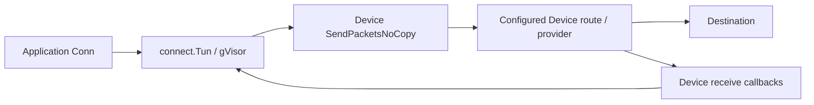

# Device sockets

Design, implementation, and Direct Sockets research. Reviewed September 15, 2026.

## Purpose and scope

An SDK Device can open application connections through its packet path without an application creating a kernel socket or installing an operating-system VPN interface. Go callers receive `net.Conn`-compatible connections; JavaScript, C, and mobile bindings expose the same behavior in their own types. The first release provides outbound TCP, UDP, TLS over TCP, DTLS over UDP, and a JavaScript Direct Sockets client interface. Server sockets, listeners, multicast, and unconnected UDP are future work.

The central UDP decision is explicit: **for a hostname with both A and AAAA records, race the initial application datagram and select the first replying address. The initial datagram can be delivered to both addresses.** Later datagrams wait for selection and use only the winner. This is application-visible behavior, not a transparent implementation detail.

The implementation is in [`socket.go`](socket.go), [`socket_udp.go`](socket_udp.go), [`socket_rpc.go`](socket_rpc.go), [`socket_mobile.go`](socket_mobile.go), [`js/socket.go`](js/socket.go), [`js/src/socket.ts`](js/src/socket.ts), and [`cgo/exports_socket.go`](cgo/exports_socket.go). User-facing guidance belongs in the ur.io Developers → Socket page. Package distribution is covered separately in [PACKAGEMANAGERS.md](PACKAGEMANAGERS.md).

## Research findings: Direct Sockets

The compatibility target is the WICG Direct Sockets proposal: `TCPSocket(host, port, options)` and `UDPSocket(options)`, `opened`/`closed` promises, and Web Streams. TCP supports byte/BYOB reads and BufferSource writes; connected UDP carries `UDPMessage` objects. The proposal also describes server and bound-UDP modes, which remain outside this outbound release.[^direct]

Chrome exposes its native implementation to Isolated Web Apps, subject to their permissions policies. The SDK instead binds the familiar constructor signatures to one initialized UR Device; applications can use them in ordinary browsers and Node without an IWA package or browser Direct Sockets permission. It does not install global constructors, open a destination kernel socket, or change browser permissions.[^chrome-direct]

The adapter uses the existing Device dialer and Conn bridge. No session protocol or specialized server is required: an ordinary TCP or UDP endpoint is sufficient. The API is a documented client compatibility profile, not complete browser/WebIDL conformance. Options that cannot be honored fail explicitly. The earlier session API and its protocol implementation have been removed.

## Go API and socket semantics

`Device` embeds these method interfaces. `net.Dialer` itself is a struct; its `Dial` and `DialContext` signatures are preserved, with two SDK secure-dial extensions in a separate interface:

```go
type Conn = net.Conn

type Dialer interface {
    Dial(network, address string) (net.Conn, error)
    DialContext(ctx context.Context, network, address string) (net.Conn, error)
}

type TLSDialer interface {
    DialTls(network, address string, config *tls.Config) (net.Conn, error)
    DialTlsContext(ctx context.Context, network, address string, config *tls.Config) (net.Conn, error)
}
```

Both `DeviceLocal` and `DeviceRemote` implement both interfaces. A standard `net.Dialer` satisfies `Dialer` but does not itself implement the additional SDK secure methods. Existing integrations can use `device.DialContext` directly as an HTTP transport or other client's dial function; they do not need to type-assert a concrete SDK connection.

| Aspect | Contract |
| --- | --- |
| Networks | `tcp`, `tcp4`, `tcp6`, `udp`, `udp4`, `udp6` |
| Address | `host:port`; bracket IPv6 literals, such as `[2001:db8::1]:443` |
| Establishment | Caller context plus a default 30-second dial/secure-handshake bound; earlier caller cancellation wins |
| Post-dial cancellation | The dial context controls establishment. Canceling it after success does not close the connection. |
| Ownership | Caller closes connections; canceling/closing the owning Device also closes them. |
| TCP | Byte stream; reads/writes can be partial. EOF is separate from data. Concurrent operations are supported. |
| UDP | Connected peer; each write is one datagram, each read consumes one datagram. An undersized read discards the remainder. Zero-byte datagrams are valid. |
| Deadlines | Absolute read/write deadlines, including pending I/O; `time.Time{}` clears them. Timeouts implement `net.Error`. |
| Half-close | Optional `CloseRead`/`CloseWrite` for connections that support them; not an unconnected-UDP control. |
| Addresses | Virtual local endpoint and selected remote endpoint. The local address is not the provider's public exit address. |
| Kernel-specific APIs | No file descriptor, `SyscallConn`, socket options, Unix-domain socket, packet capture socket, or arbitrary bind/listen operation |

Example: replace only an HTTP client's connection factory:

```go
transport := &http.Transport{DialContext: device.DialContext}
client := &http.Client{Transport: transport, Timeout: 20 * time.Second}
// Standard net/http handles HTTPS TLS above the Device connection.
defer transport.CloseIdleConnections()
```

For direct TLS use `device.DialTlsContext(ctx, "tcp", "example.com:443", nil)`. `nil` selects normal certificate verification. Go TLS configuration is cloned before SDK changes, and SNI is inferred from the original hostname rather than the winning IP.

## Local Device packet path



Each Device lazily creates one private `connect.Tun`, sharing it among its sockets. This is an in-process IP/TCP/UDP stack, not an OS TUN file descriptor. It allocates distinct virtual IPv4/IPv6 addresses from connect's address pools. Ordinary Device construction remains cheap until the first socket is opened.

The outbound worker reads packet batches from the TUN and gives ownership to `SendPacketsNoCopy`. It clears the consumed batch references. Inbound callbacks inspect the packet's destination IP and inject only packets addressed to that private TUN. Matching uses the IP header rather than a transport-port parser: later IP fragments contain no TCP/UDP ports and must still reach gVisor reassembly. The source receive buffer is borrowed only for the synchronous injection.

Closing the Device prevents further opens, closes tracked connections and the TUN, removes the receive subscription, and joins the packet pump as part of the Device's close boundary. A connection closes at most once in the tracking wrapper. Cached endpoint addresses remain available after the underlying netstack connection closes.

The socket follows the Device's routing, provider selection, security policy, and connection lifecycle. Underlying carriers and an exit NAT may use kernel sockets. The claim is that the **application's connection and protocol stack** are in user space and follow the Device; it is not a claim that no process in the network uses an operating-system socket. Selecting a Device mode with local routing continues to mean local routing.

### DNS and isolation

Socket resolution uses the private TUN's resolver. Configured local and remote resolver endpoints are projected onto its remote path, so their traffic travels through the same Device. The host resolver fallback is disabled for this socket resolver. A missing/unavailable provider does not cause an application hostname to be resolved or connected directly through the host as a fallback.

The resolver configuration is derived from Device DNS settings. Updating the live settings replaces the private TUN resolver/cache for subsequent queries and retires the old cache; existing established sockets retain their peers. DNS override/interception behavior elsewhere in the Device remains its own layer.

## Happy Eyeballs

RFC 8305 provides the basis for staggered family attempts: prefer IPv6 when available, start the other family promptly, and dispose of unsuccessful attempts. Its full algorithm also addresses asynchronous DNS timing and address ordering. The SDK uses connect's TCP resolver/racing behavior and an explicit 250 ms family delay for secure handshakes and raw UDP first-datagram selection. The new UDP wrapper waits for the two family resolutions; it is not a claim to implement every RFC 8305 DNS timing recommendation.[^happy]

Explicit `tcp4`/`udp4` or `tcp6`/`udp6` restrict the family. A literal IP selects its family without a hostname race. For generic names with only one usable family, use that family. Errors and caller cancellation clean up attempts; a successful late loser is closed even if a lower dialer returns after cancellation.

### TCP and secure handshakes

Plain TCP uses `connect.Tun.DialContext`'s connection racing. A winner has completed a TCP connection. TLS races family-specific TCP **plus TLS handshakes**, allowing a family with a stalled or failing TLS handshake to lose to a working family. DTLS similarly races completed DTLS handshakes. A successful bare UDP `connect` cannot be used as evidence that DTLS works on that path.

Only handshake traffic is raced for secure connections. Application writes begin after a winner is returned; the raw-UDP duplicate-initial-application-datagram policy does not apply to TLS or DTLS application data. Multiple connection attempts can nevertheless be observed by servers.

### Plain UDP: initial datagram and first reply

1. Resolve/dial IPv6 and IPv4 candidates through the Device. If both exist, return an undecided connected-UDP wrapper. `Dial` has not established reachability.
2. The first `Write` snapshots its bytes and sends them to IPv6. If that write fails, try IPv4 immediately. Otherwise, send the same initial datagram to IPv4 after 250 ms without a reply.
3. Read one initial response from each candidate. The first response, including a zero-length datagram, permanently selects that candidate. Preserve it for the application's first `Read` and close the losing socket.
4. Subsequent writes wait until a winner exists, then send once to that peer. Later replies from the loser cannot change the connection. The fallback write cannot block processing a reply arriving on the other family.
5. Deadline expiration unblocks waiting application operations. Clearing/extending the deadline allows recovery while the family selection is pending. Closing the connection terminates candidate reads/writes and selection.

**Duplicate delivery is possible even when one server never replies.** The first write succeeding means the datagram was accepted for sending, not that it was delivered or a peer was selected. Application protocols should use request IDs/idempotence where appropriate. A send-only protocol or a server that waits for multiple requests before replying cannot select a winner with this policy: use a literal address or `udp4`/`udp6`, or arrange a first-message response. Set deadlines instead of allowing an undecided connection to wait indefinitely.

No arbitrary probe datagram is invented. No additional application datagrams are queued for replay to multiple peers. No winner is changed automatically after selection if the route later fails.

## TLS and DTLS

TCP uses Go `crypto/tls`; UDP uses Pion DTLS v3 with DTLS 1.2. `connectedPacketConn` adapts the Device `net.Conn` to `net.PacketConn` while rejecting writes to any address other than its connected peer. Pion's handshake is explicitly driven with the dial context before returning the connection.[^dtls]

The portable `SocketTLSOptions` contains `serverName`, `rootCAPEM`, and `nextProtos`. Supplying root PEM replaces the default trust pool; invalid PEM fails. JS/C/mobile APIs keep verification enabled. Native Go can supply `tls.Config`, including an explicit verification policy for TCP.

For DTLS the shared configuration supports roots, server name, client certificates, application protocols, `VerifyPeerCertificate`, explicit Go verification bypass, and key logging. Options without an equivalent supported mapping—such as TLS `VerifyConnection`, TLS client-certificate callback, custom cipher/curve lists, ECH, custom time/random sources, TLS session cache, or a version range excluding DTLS 1.2—fail rather than being silently treated as enforced. DTLS 1.3 is not implemented.

The WASM executable includes `golang.org/x/crypto/x509roots/fallback` because a browser-hosted Go executable cannot assume a native system certificate store. This dependency embeds trust roots and must be kept current with SDK rebuilds. Custom root PEM is an explicit alternate trust input.[^roots]

## Remote Device and C/mobile bindings

### Remote sockets

The existing Device RPC dispatcher serves requests sequentially. Blocking `Dial` or `Read` inside an RPC method would prevent another request from setting a deadline or closing the socket. `DeviceLocalRpc.Socket` therefore implements start/poll operations: starting an open/read/write queues work and immediately returns; later polls consume the completed result once. Deadline/close controls stay responsive.

An RPC session owns a random-ID registry limited to 128 sockets, including pending opens. Each entry permits one pending read and one pending write, with a maximum 65,535-byte operation buffer. The client serializes reads and writes independently and chunks large TCP writes. It never splits a UDP datagram into separate writes. EOF, cancellation, closed-state, and timeout errors are encoded separately from byte counts so partial results are retained.

`DeviceRemote` captures the active ordinary or browser service at dial time. A connection remains bound to that service; it is not rebound or replayed after reconnect. Session shutdown cancels pending dials, closes sockets, and joins workers. IDs cannot be used from another RPC session. An older peer without the optional method returns an error; the client does not fall back to a kernel connection.

TLS/DTLS can run in the client above this raw RPC connection. In the JS SDK that keeps the secure-protocol state in WASM while the owning remote Device supplies the packet path. Polling and buffer copies add overhead; these APIs emulate socket behavior, not the performance of a local file descriptor.

### C ABI

`urnet_device_dial` and `urnet_device_dial_tls` return owned connection handles. `urnet_conn_read`/`urnet_conn_write` perform actual I/O and report transferred bytes; reading is not a size-query/fill protocol. A separate `eof` output distinguishes EOF from a zero-byte UDP datagram. Partial byte counts can accompany an allocated error string. Clear/read/write deadline functions take epoch milliseconds; zero clears the deadline.

`urnet_conn_close` closes while retaining the handle; `urnet_release` releases it and closes its connection. Free returned error/address strings with `urnet_free_string`. Calls can block, so invoke them on worker threads. The C boundary validates pointer/length combinations and copies outgoing bytes before work may outlive the caller. The generated header documents buffer limits and ownership.

### Android and Apple bindings

`Device.OpenSocket(network, address, timeoutMillis, tlsOptions)` returns the portable `Socket` class. Nil TLS options request a plain socket; a nonnil options object requests TLS/DTLS. `Socket.Read(maxBytes)` returns `SocketRead{Data, Eof}`; deadline methods take epoch milliseconds. This avoids exporting `context.Context`, `net.Addr`, and `time.Time` through gomobile. Native-only methods are explicitly excluded by the export validator; portable methods remain subject to validation.

All three gomobile binds select the internal `sdk_mobile_bind` build tag (combined with `ios_extension` for the reduced Apple binding). Only that binding view removes `Dialer` and `TLSDialer` from the `Device` interface; every default/native Go target, including native Go on Android and Apple, retains both interfaces. Concrete Device dial implementations and `OpenSocket` are unchanged. Do not use this internal tag for Go embedding. An export-omission allowlist alone cannot make gobind's incomplete foreign proxy implement native-only method signatures.

## JavaScript SDK

SDK factories attach `dial`, `dialTls`, and `directSockets` to Device wrappers, including proxy callbacks and returned Devices. The WASM bridge uses one asynchronous dispatcher per Device and monotonically allocated resource handles, capped at 512 sockets. A lifecycle notification wakes idle Direct Sockets when their Device closes. Device cancellation/closure tears down its registry and closes late dial results.

```ts
// `device` is an initialized SDK Device with an available packet path.
const conn = await device.dial("tcp", "example.com:80", { timeoutMillis: 5000 });
try {
  await conn.setDeadline(Date.now() + 5000);
  await conn.write(new TextEncoder().encode("GET / HTTP/1.0\r\nHost: example.com\r\n\r\n"));
  for (let chunk; (chunk = await conn.read()) !== null;) {
    console.log(new TextDecoder().decode(chunk));
  }
} finally {
  await conn.close();
}
```

`Conn.read()` returns bytes or `null` for EOF; an empty `Uint8Array` is data. It also provides `ReadableStream`/`WritableStream` adapters. Do not mix direct reads/writes with their stream adapters concurrently. TCP logical writes are serialized across their bridge chunks; UDP boundaries are preserved. Inputs are copied before asynchronous work. Partial writes reject with `bytesWritten`; partial read data is returned before its accompanying error on the next read. Read deadlines can be cleared and retried through direct `read`; an errored Web Stream follows normal Web Streams terminal-error semantics.

`AbortSignal` and `timeoutMillis` control opening/handshakes. Established connections use deadlines and explicit close. WASM I/O runs in Go goroutines and resolves Promises without blocking the JS event loop.

### Direct Sockets client profile

`const {TCPSocket, UDPSocket} = device.directSockets` selects constructors bound to that Device. The exported `createDirectSockets(device)` factory supplies the same interface for dependency injection. Constructor arguments then match the Direct Sockets API, without an extra Device parameter. TypeScript exports the corresponding socket, options, open-info, and UDPMessage types.

```ts
const {TCPSocket, UDPSocket} = device.directSockets;
const tcp = new TCPSocket("echo.example", 9000);
const {readable, writable} = await tcp.opened;
const writer = writable.getWriter();
const reader = readable.getReader({mode: "byob"});
try {
  await writer.write(new TextEncoder().encode("hello"));
  await writer.close(); // FIN; the readable side remains usable.
  console.log(await reader.read(new Uint8Array(1024)));
} finally {
  await Promise.allSettled([reader.cancel(), writer.abort()]);
  reader.releaseLock(); writer.releaseLock();
  await tcp.close(); await tcp.closed;
}

const udp = new UDPSocket({remoteAddress: "echo.example", remotePort: 9001});
const info = await udp.opened;
const udpWriter = info.writable.getWriter();
const udpReader = info.readable.getReader();
try {
  await udpWriter.write({data: new Uint8Array([1, 2, 3])});
  const reply = await udpReader.read();
  console.log(reply.value?.data); // An empty data array is a valid datagram.
} finally {
  await Promise.allSettled([udpReader.cancel(), udpWriter.abort()]);
  udpReader.releaseLock(); udpWriter.releaseLock();
  await udp.close(); await udp.closed;
}
```

| Feature | SDK behavior |
| --- | --- |
| Lifecycle | `opened` resolves to streams and endpoint fields; `closed` resolves after both directions end and the connection is released. Opening/network failures reject with `NetworkError`. |
| TCP I/O | Byte stream with default and BYOB readers; BufferSource writes, backpressure, large-write chunking, partial I/O error preservation, and FIN/half-close. |
| Connected UDP I/O | One `{data}` record per datagram; no destination fields in received messages. Per-message destination overrides reject with TypeError. No BYOB reader. |
| Close | Promise-returning `close()` rejects with `InvalidStateError` before opening or while a reader/writer is locked. Cancel/abort pending I/O and release locks first. Repeated completed close is idempotent. |
| Ownership | Closing the Device notifies idle sockets and errors active streams. Every completed connection releases its WASM handle. |
| DNS | `dnsQueryType: "ipv4" / "ipv6"` restricts the family. Omission preserves Device hostname Happy Eyeballs. IPv6 constructor addresses are unbracketed. |
| Tuning | Explicit `noDelay`, `keepAliveDelay`, `sendBufferSize`, and `receiveBufferSize` are validated and rejected with `NotSupportedError`; the Device's existing stack defaults apply. |
| Future work | `TCPServerSocket`, bound/unconnected UDP, multicast, local binding, transferability, and complete WebIDL conformance. Unsupported valid binding/multicast requests throw `NotSupportedError`. |
| Encryption | These constructors open plain TCP/UDP. The SDK's separate `dialTls` method provides TLS/DTLS. |

The UDP Happy Eyeballs policy is unchanged: `opened` makes the streams available before any datagram is sent, because waiting for a reply there would prevent the application from sending its initial datagram. A dual-family socket's address fields initially identify the first candidate and update after its first reply is consumed. Use a literal IP or `dnsQueryType` when a fixed endpoint tuple is required at opening. The first application datagram may reach both addresses; subsequent messages use the selected peer.

Socket construction has the Device's default 30-second establishment bound. Direct Sockets has no per-I/O deadline member; use an application timer that cancels/aborts the streams, or use `Conn` when explicit deadlines and TLS/DTLS are needed. The runnable examples demonstrate cleanup on timeout.

## Platforms, validation, and future listeners

The Go implementation builds on the SDK's existing Go targets. Android and Apple use portable gomobile bindings; C clients use the desktop C ABI. The JS package loads its WASM runtime in Node 24+ and modern browsers. Both environments use a configured reachable Device RPC endpoint with socket support. The browser does not require native Direct Sockets globals. Bun and other JS runtimes have not been qualified.

The network tests use two real connect/gVisor TUNs with an in-memory Device packet route, local dual-family DNS servers, and actual TCP/UDP/TLS/DTLS peers. No public DNS, provider account, or Internet echo service is needed for the socket tests. They cover:

- Network/family matrix; names with working or blackholed IPv4/IPv6; TLS/DTLS handshake racing and inferred SNI.
- TCP partial/large I/O, deadlines and recovery, cancellation, half-close, EOF, and close unblocking reads.
- UDP empty datagrams, truncation, boundaries, IPv4/IPv6 fragmentation, initial duplicate delivery, delayed loser replies, no reply/deadline recovery, and fixed winner routing.
- RPC responsiveness with blocked reads/dials, session isolation, limits, disconnects, and no replay.
- Direct Sockets constructor signatures, connected UDP messages, TCP BYOB reads, stream lock validation, half-close, pending-I/O cancellation, Device closure, and resource release. The real Go/WASM bridge carries TCP/UDP packets for IPv4 and IPv6.
- C ABI byte counts/errors, EOF, bad buffers, deadline reset, release during reads, and stale handles.
- TypeScript stream backpressure, lifecycle/error propagation, byte snapshots, large concurrent writes, and Go/WASM dispatcher/lifetime tests.
- Real WASM initialization and closure in Node and Chrome, ESM/CommonJS package consumers, and executable Node/browser examples. Node's Undici/Axios adapters and Python's HTTPX/Requests adapters are tested against local HTTP and verified HTTPS peers.

Useful commands:

```sh
go test -race . -run '^TestSocket' -count=1 -timeout=90s
go test -short ./... -timeout=180s
(cd cgo && go test -race . -run '^TestSocketABI' -count=1)
(cd js && npm run build && npm test)
(cd js && GOOS=js GOARCH=wasm go test -exec="$(go env GOROOT)/lib/wasm/go_js_wasm_exec" . -run 'TestSocketWasm|TestDirectSocketsWasm')
```

Generated C/C++ exports and Java gomobile exports are also checked. A macOS arm64 XCFramework is built and linked into the Swift example and an isolated SwiftPM consumer. An Android arm64 AAR and its sources/Javadocs are built and packaged. Full Apple/Android device coverage and cross-platform live-provider/browser interoperability remain release qualification work; passing host/Go/WASM tests does not substitute for them. The repository's long-running leak/soak tests need their own time budget rather than the short unit-test timeout.

Future server work should add a separate listener/packet-listener surface with explicit bind semantics, provider reachability, accept cancellation, ownership, and authorization. It must not imply that a virtual local address is publicly reachable. Preserve the outbound `Conn` contract and avoid changing established UDP winner semantics when listener support arrives.

## Sources

Primary sources were consulted for protocol/API definitions; repository code and tests establish SDK-specific behavior. Research status is dated above because the Direct Sockets proposal remains active work.

[^direct]: [WICG Direct Sockets API](https://wicg.github.io/direct-sockets/).
[^chrome-direct]: [Chrome Direct Sockets and Isolated Web Apps](https://developer.chrome.com/docs/iwa/direct-sockets).
[^happy]: [RFC 8305: Happy Eyeballs Version 2](https://www.rfc-editor.org/rfc/rfc8305.html).
[^dtls]: [Pion DTLS v3 API](https://pkg.go.dev/github.com/pion/dtls/v3).
[^roots]: [Go x509roots fallback package](https://pkg.go.dev/golang.org/x/crypto/x509roots/fallback).
